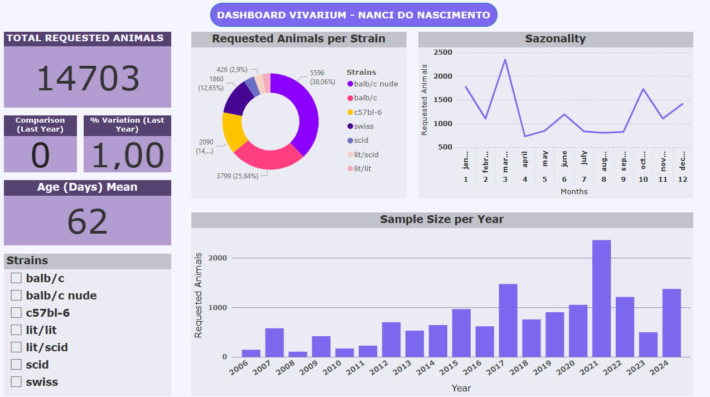

# Análise de Dados e Dashboard - Biotério Nanci do Nascimento (IPEN-USP)

## 📖 Descrição

Este projeto foi motivado pela observação de um excedente populacional de animais durante as atividades de rotina no Biotério Nanci do Nascimento (IPEN-USP). A proposta inicial de otimizar a população gerou a necessidade de comprovar, através da análise de dados, a viabilidade de reduzir o número de animais mantendo uma margem de segurança.

O objetivo é demonstrar que essa otimização pode levar a benefícios diretos, como a redução de custos operacionais (ração, maravalha) e, principalmente, a diminuição da carga de trabalho para a equipe técnica.

## 🎯 Objetivo Principal

Analisar os dados históricos de solicitação de animais para identificar padrões de demanda (por linhagem, idade e sazonalidade) e fornecer insights que suportem uma estratégia de otimização da população do biotério, visando a redução de custos e carga de trabalho.

## 🛠️ Tecnologias Utilizadas

* **Linguagens:** Python, SQL
* **Bibliotecas Python:** Pandas, NumPy, Matplotlib, Seaborn, SQLAlchemy, Psycopg2
* **Banco de Dados:** PostgreSQL
* **Cloud:** Google Cloud Platform (GCP) - especificamente Cloud SQL para PostgreSQL
* **BI & Visualização:** Microsoft Power BI
* **Versionamento:** Git & GitHub

## ⚙️ Metodologia e Etapas

1.  **ETL e Limpeza de Dados:**
    * Desenvolvimento de scripts em Python (`etl_limpeza.py`) utilizando Pandas para:
        * Carregar os dados do arquivo `vivarium_data.csv`.
        * Padronizar nomes de colunas (lowercase, renomear para inglês).
        * Limpar e padronizar dados textuais (linhagens, meses - lowercase, trim).
        * Remover colunas irrelevantes ou com muitos dados faltantes (ex: 'peso').
        * Tratar valores ausentes na coluna 'idade'.
        * Criar uma coluna padronizada `age_days` (idade em dias) a partir de formatos inconsistentes (semanas, meses, dias, intervalos).
        * Criar colunas numéricas (`month_num`) e traduzidas (`month_en`) para os meses.
    * O resultado final é um DataFrame limpo e pronto para análise.

2.  **Análise Exploratória de Dados (EDA):**
    * Realizada no notebook Jupyter (`exploratory_data_analysis.ipynb`).
    * Utilização de Pandas para agregações e estatísticas descritivas.
    * Geração de visualizações com Matplotlib e Seaborn para identificar padrões chave:
        * **Popularidade de Linhagens:** Identificação das linhagens mais e menos solicitadas (Gráfico de Barras Ordenado).
        * **Perfil Etário:** Análise da distribuição das idades dos animais no momento da solicitação (Histograma, Boxplot).
        * **Sazonalidade:** Verificação de padrões de demanda ao longo dos meses (Gráfico de Barras/Linhas Mensal).
        * **Tendência Temporal:** Análise da evolução da demanda ao longo dos anos, por linhagem (Gráfico de Linhas/Pontos).

3.  **Estruturação do Banco de Dados:**
    * Definição do esquema de uma tabela relacional em PostgreSQL para armazenar os dados limpos.
    * Criação da tabela no banco de dados, estabelecendo tipos de dados adequados para cada coluna.
    * Implementação do banco como uma fonte única e confiável para os dados tratados.

4.  **Implantação da Infraestrutura:**
    * Provisionamento de uma instância gerenciada de PostgreSQL utilizando o **Google Cloud SQL**.
    * Configuração de segurança (permissões de rede/firewall por IP) para acesso seguro.
    * *(Conhecimento demonstrado também em instalação e configuração manual em servidores Linux, gestão de usuários e permissões).*
    * Importação dos dados limpos do CSV para a tabela no Cloud SQL utilizando Python (Pandas + SQLAlchemy).

5.  **Desenvolvimento do Dashboard:**
    * Conexão do **Microsoft Power BI** diretamente à instância PostgreSQL no Google Cloud.
    * Criação de um dashboard interativo contendo:
        * **KPIs (Indicadores Chave):** Cartões exibindo métricas principais (Total de Amostras, Linhagem Mais Pedida, Idade Média, Variação vs Ano Anterior).
        * **Visuais Dinâmicos:** Gráficos de barras, linhas e histograma refletindo os insights da EDA.
        * **Filtros Interativos:** Slicers permitindo a exploração dos dados por Ano e Linhagem.
        * **Medidas DAX:** Criação de cálculos personalizados para KPIs avançados e controle de visuais.

## 📊 Principais Insights da Análise

* **Concentração da Demanda:** Uma grande maioria das solicitações (~78%) se concentra em apenas três linhagens principais (balb/c nude, balb/c, c57bl-6).
* **Linhagens de Baixa Demanda:** Identificação de linhagens com solicitações muito baixas e/ou sem pedidos recentes (lit/lit, lit/scid, scid, swiss), sugerindo potencial para otimização via criação sob demanda ou compra externa.
* **Perfil Etário:** A demanda principal é por animais adultos jovens, concentrada na faixa de 40 a 70 dias, com picos notáveis que podem indicar necessidades específicas por linhagem ou tipo de experimento.
* **Sazonalidade Marcada:** A demanda apresenta picos significativos no início do ano (Março/Abril) e vales acentuados nos períodos de férias acadêmicas (Julho/Dezembro), permitindo um planejamento mais eficiente de recursos e produção.

## 🖥️ Visualização (Dashboard)

*(Aqui você pode adicionar uma ou duas screenshots do seu dashboard final)*

